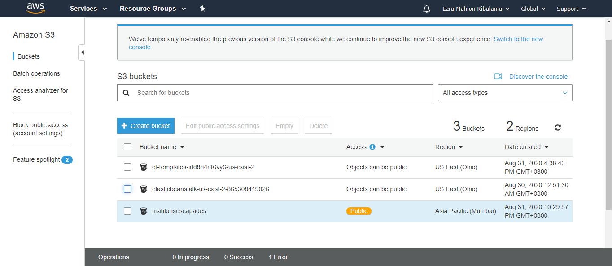
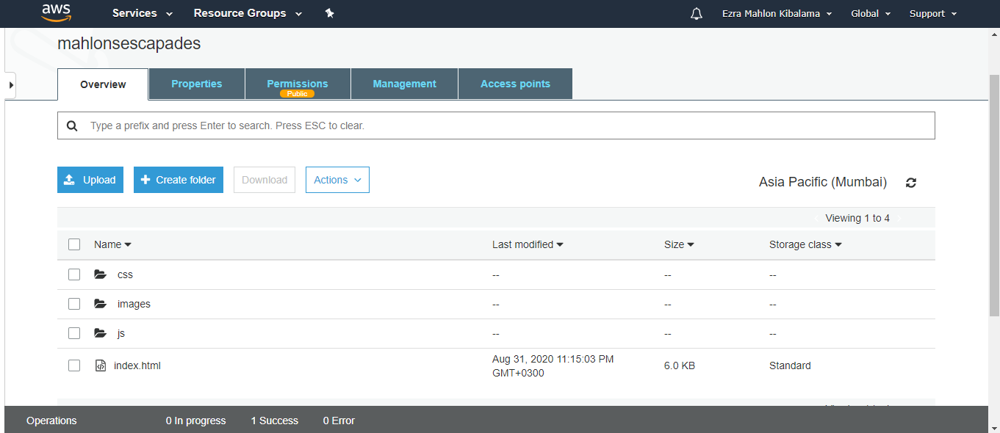
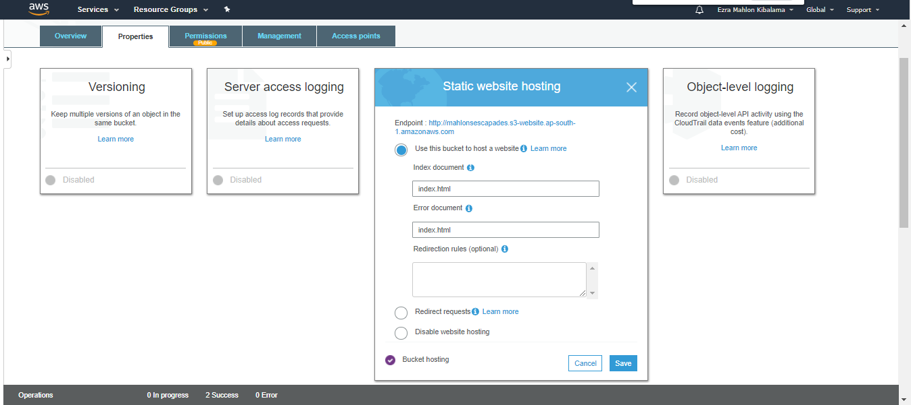
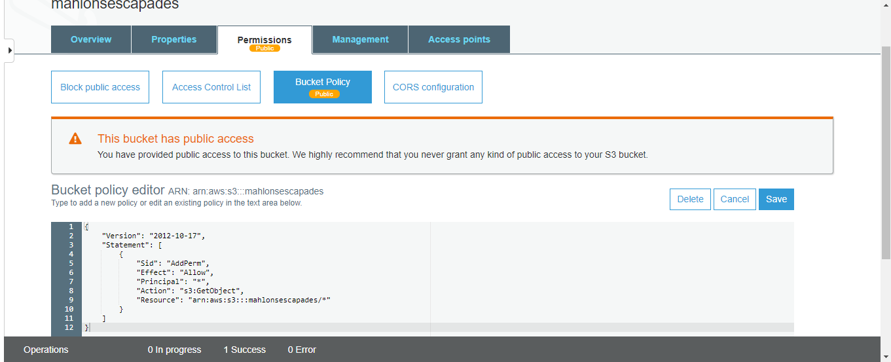
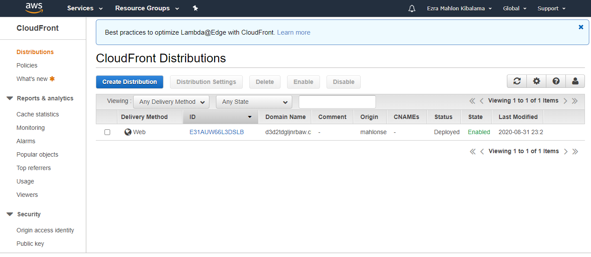

# Mahlon escapades
This is a static website that demonstrates how to deploy a static website to AWS.

# Prerequisites
1. An AWS account

# Web browser accessible URL
Copy this URL and paste in a web browser such as google chrome or firefox.  

**Link** : d3d2tdgljnrbaw.cloudfront.net/index.html

# Steps
1. Create an S3 Bucket

2. Upload static website files to the S3 bucket

3. Configure the S3 bucket to support static wbsite hosting

4. Configure S3 bucket IAM policy to make contet accessible to the public

5. Configure CloudFront to retrieve and distribute website files.

